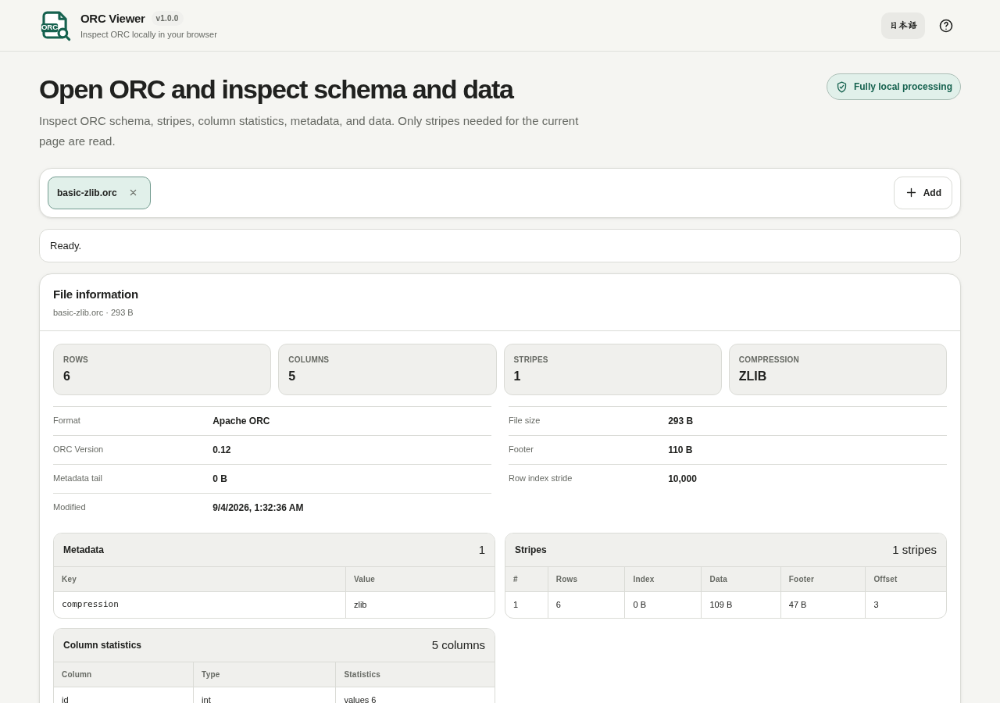

# ORC Viewer

[](https://github.com/ttomohisa/htmlapps-orc-viewer/actions/workflows/deploy-pages.yml)
[](LICENSE)
[](https://ttomohisa.github.io/htmlapps-orc-viewer/)

[日本語版 README](README.ja.md)

A privacy-focused, single-HTML viewer for opening Apache ORC files and inspecting schema, stripes, column statistics, metadata, compression, and paged data without uploading selected files to a server.

## 🚀 Live demo

### [Open ORC Viewer on GitHub Pages](https://ttomohisa.github.io/htmlapps-orc-viewer/)

GitHub Pages delivers the initial HTML. After it loads, selected files are read and processed locally on your device. The app does not upload the file contents.

[](https://ttomohisa.github.io/htmlapps-orc-viewer/)

## Features

- **Inspect the ORC file tail first** — Read PostScript and Footer information before decoding row data.
- **Review schema, stripes, and column statistics** — Inspect nested schema, stripe layout, compression, metadata, and file-level column statistics.
- **Decode only stripes needed for the current page** — Avoid expanding the entire ORC file into memory at once.
- **Handle nested values** — Preview primitive values plus struct / list / map / union data supported by the reader.
- **Support common compression modes** — Read NONE, ZLIB, SNAPPY, and LZ4; use ZSTD when the browser exposes a compatible decoder.
- **Inspect and export current-page data** — Use Table / Record views, column visibility, sorting, Cell Inspector, and CSV copy/save.
- **Keep per-file state isolated** — A broken ORC file does not block other files or leave stale content in another tab.

## Quick start

### Use the web demo

Just [open the demo](https://ttomohisa.github.io/htmlapps-orc-viewer/). No installation or account is required.

### Use the standalone HTML

1. Download [`dist/index.html`](https://github.com/ttomohisa/htmlapps-orc-viewer/blob/main/dist/index.html) from this repository.
2. Open it directly in a current Chromium-based browser, Firefox, or Safari.

The repository also includes `dist/index.self-extract.html`, a self-extracting single-HTML variant that restores the readable standalone HTML in the browser before the app starts.

### Build it locally

1. Download or clone this repository.
2. Double-click `build-standalone.bat` on Windows.
3. The build generates and verifies `dist/index.html` and `dist/index.self-extract.html`.
4. Open either generated file directly from your device.

Python, Node.js, and a local web server are not required. The builder uses Windows PowerShell and the built-in `tar.exe`.

## Usage

1. Add one or more `.orc` files.
2. Review row count, compression, stripe count, metadata, and column statistics.
3. Inspect schema as Tree or Raw.
4. Browse records with the paging controls. Only stripes needed for the current page are decoded.
5. Switch between Table and Record views and inspect full nested values in Cell Inspector.
6. Copy or save the current page as CSV.

## Publish with GitHub Pages

The repository includes a workflow that builds the standalone HTML and deploys `dist/` to GitHub Pages automatically.

1. Push the repository to GitHub as `htmlapps-orc-viewer`.
2. Open **Settings → Pages → Build and deployment → Source** and select **GitHub Actions**.
3. Push to `main`, or manually run **Deploy standalone app to GitHub Pages** from the Actions tab.
4. After a successful deployment, the demo is available at `https://ttomohisa.github.io/htmlapps-orc-viewer/`.

Each push to `main` runs the repository checks, rebuilds the standalone files, and publishes the verified `dist/` output when GitHub Pages is enabled.

## Development and build layout

```text
.
├─ src/index.template.html       # Application template
├─ app.config.json               # App metadata, version, and build settings
├─ dependencies.json             # Runtime dependency declarations
├─ dependencies.lock.json        # Dependency lock metadata
├─ build-standalone.bat          # Windows build entry point
├─ build-standalone.ps1          # Standalone HTML builder
├─ scripts/check-repository.ps1  # Repository/build verification
├─ dist/index.html               # Readable single-HTML artifact
├─ dist/index.self-extract.html  # Self-extracting single-HTML artifact
└─ .github/workflows/
   ├─ build-standalone.yml       # Build validation
   └─ deploy-pages.yml           # Automatic GitHub Pages deployment
```

### Build and verify

```bat
build-standalone.bat
```

Repository checks can also be run directly:

```powershell
powershell.exe -NoLogo -NoProfile -ExecutionPolicy Bypass -File .\scripts\check-repository.ps1
```

The build/verification flow checks the dependency lock, generates the standalone artifacts, verifies unresolved placeholders and runtime-network restrictions, and builds/verifies the self-extracting variant.

## Privacy and runtime network protection

The generated standalone HTML includes a Content Security Policy with `connect-src 'none'`. Selected files are read through browser file APIs and stay on the device. The app does not require analytics, telemetry, an external API, or a runtime CDN.

The GitHub Pages version requires one initial request to load the HTML. After that, the files you select are processed locally by the app. For use with the network completely disconnected, open `dist/index.html` directly.

The ORC reader is implemented from the public Apache ORC file-format specification. Apache ORC is an Apache Software Foundation project; this viewer is an independent tool.

## Limitations

- Read-only: ORC files are not edited or rewritten.
- LZO decompression is not supported.
- ZSTD support depends on browser capabilities.
- CSV export covers the current page, not the whole file.
- This is a viewer rather than a SQL/query engine.

## Dependencies

ORC Viewer v1.0.0 does not bundle third-party runtime JavaScript libraries.

See [THIRD_PARTY_NOTICES.md](THIRD_PARTY_NOTICES.md) for format/project notices.

## Contributing

Bug reports and feature proposals are welcome through GitHub Issues. See [CONTRIBUTING.md](CONTRIBUTING.md) for development guidance.

## License

Copyright © 2026 ttomohisa

Licensed under the [MIT License](LICENSE).
